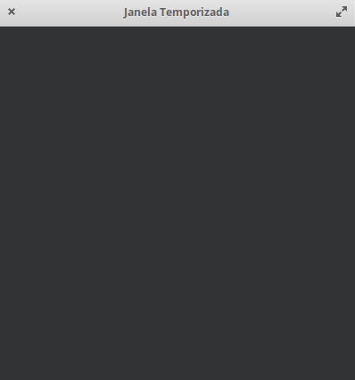
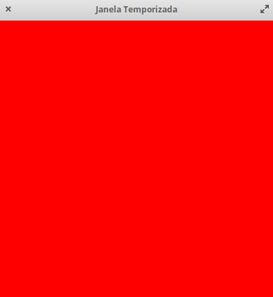
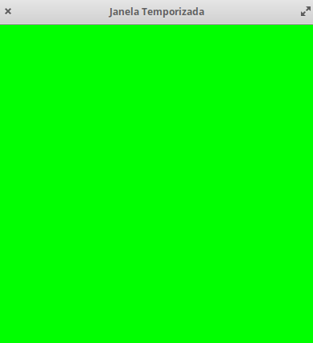
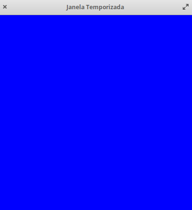

# CG P1
> Ana Rocha, a63971

## Objetivo
Este primeiro programa tem como objetivo introduzir os conceitos básicos de Computação Gráfica. </p>
Consiste num exercício muito simples em que teremos uma **janela colorida**, que muda de cor quando pressionadas as teclas *"R", "G" e "B",* mudando para a cor vermelho, verde e azul, respetivamente. Quando se pressiona a tecla *"enter"* a janela fecha-se, fechando-se também após 30 segundos desde a sua abertura. </p>

## Plataforma de Desenvolvimento
- [Github](https://github.com/AnaLuciaRocha/CG)
- Sistema Operativo: ***Elementary***, versão 5.1.6 Hera (Distribuição Ubuntu)
- Compilador 
    ```
    gcc-10 | 10.1.0-2ubuntu1~18.04 | amd64 | GNU C compiler
    ```
- Bibliotecas Necessárias
    1. glad.h
    2. glfw3.h
    3. iostrem

## Resultados
- build:
    ```
    ana@caju:~/Documents/CG/build$ make
    [ 14%] Built target glfw
    [ 16%] Built target wave
    [ 18%] Built target simple
    [ 21%] Built target gears
    [ 23%] Built target boing
    [ 25%] Built target heightmap
    [ 28%] Built target splitview
    [ 31%] Built target offscreen
    [ 35%] Built target particles
    [ 38%] Built target sharing
    [ 40%] Built target title
    [ 43%] Built target timeout
    [ 46%] Built target monitors
    [ 49%] Built target clipboard
    [ 52%] Built target cursor
    [ 55%] Built target msaa
    [ 59%] Built target glfwinfo
    [ 62%] Built target threads
    [ 64%] Built target reopen
    [ 67%] Built target triangle-vulkan
    [ 69%] Built target opacity
    [ 72%] Built target iconify
    [ 74%] Built target gamma
    [ 77%] Built target events
    [ 80%] Built target icon
    [ 83%] Built target joysticks
    [ 87%] Built target windows
    [ 91%] Built target empty
    [ 94%] Built target inputlag
    [ 96%] Built target tearing
    [ 96%] Generating HTML documentation
    [ 96%] Built target docs
    [ 97%] Built target glad
    [ 99%] Built target tp1
    [100%] Built target tp1.ex1
    ```
- run
    1. Para executar o progama corre-se o seguinte comando: ```ana@caju:~/Documents/CG/build$ ./tp1.ex1/tp1.ex1``` 
    2. Assim que o programa é executado aparece uma janela com o título *Janela Temporizada* com dimensão 400x400, como se pode ver na <a href="figura1">Figura 1</a> </p>
    
        <figure class="Figura">
        
        <figcaption>Figura 1 - Ecrã inicial</figcaption>
        </figure>

    3. De seguida caso sejam pressionadas as teclas *R*, *G* ou *B* o ecrã muda de cor como representado na <a href="figura2">Figura 2</a>, <a href="figura3">Figura 3</a> e <a href="figura4">Figura 4</a>, respetivamente. </p>

        <figure class="Figura">
        
        <figcaption>Figura 2 - Ecrã quando pressionada a tecla R</figcaption>
        </figure>

        <figure class="Figura">
        
        <figcaption>Figura 3 - Ecrã quando pressionada a tecla G</figcaption>
        </figure>

        <figure class="Figura">
        
        <figcaption>Figura 4 - Ecrã quando pressionada a tecla B</figcaption>
        </figure>
    
    
    4. Quando é pressionada a tecla *Enter* ou quando se passaram 30 segundos, a janela fecha-se e é terminada a execução.
    
