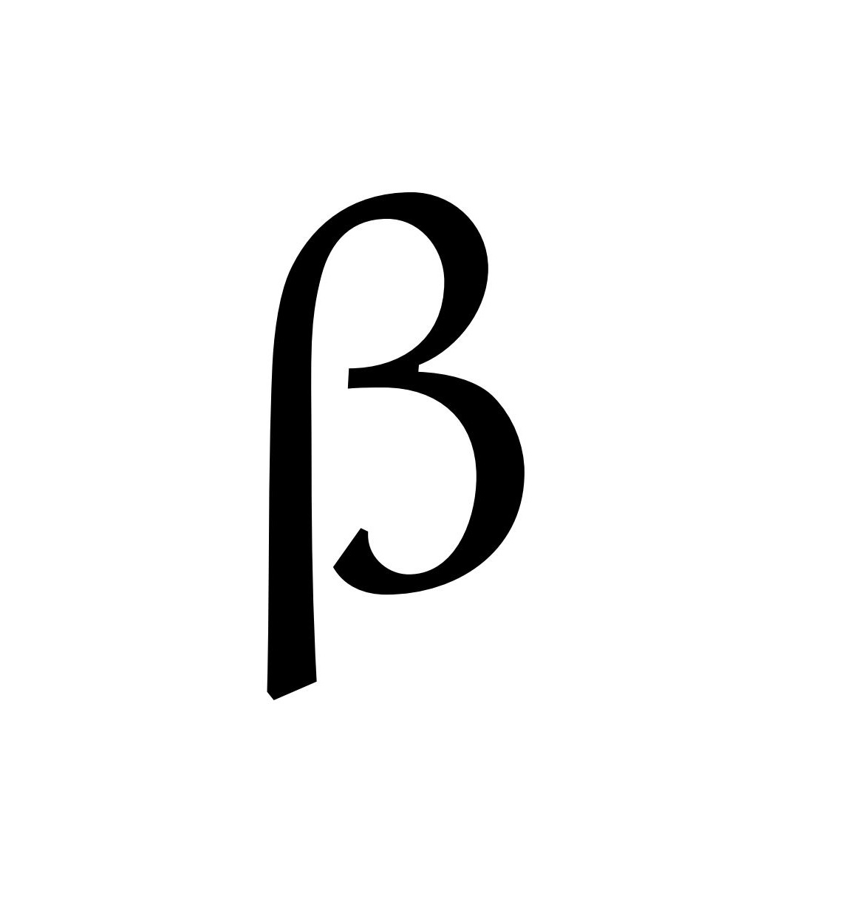
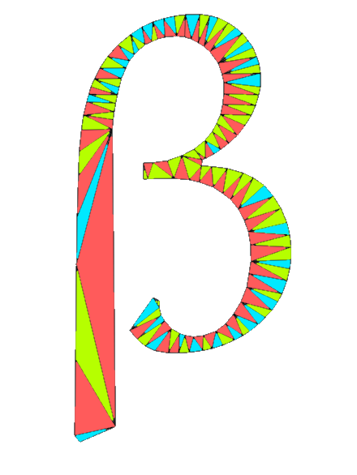
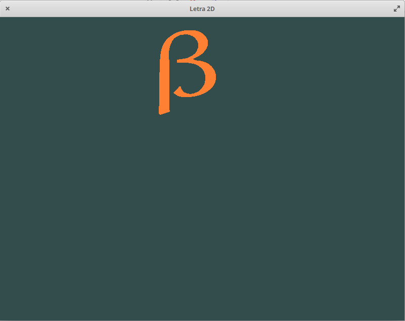

# Computação Gráfica - TP2 Símbolo 2D
> Ana Rocha, a63971

## Objetivo
Mostrar o símbolo colorido modelado a partir de triângulos. </p>

## Plataforma de Desenvolvimento
- [Github](https://github.com/AnaLuciaRocha/CG)
- Sistema Operativo: ***Elementary***, versão 5.1.6 Hera (Distribuição Ubuntu)
- Compilador 
    ```
    gcc-10 | 10.1.0-2ubuntu1~18.04 | amd64 | GNU C compiler
    ```
    </p>
    
- Bibliotecas Necessárias
    1. glad.h
    2. glfw3.h
    3. iostrem
    
- Método de "triangulização"

1. Foi utilizado o software *Gimp* para dividir a letra em diferentes triângulos, como se pode oservar pelas <a href="figura2">Figura 1</a> e <a href="figura2">Figura 2</a>. </p> 
 
 <figure class="Figura">
        
        <figcaption>Figura 1 - Letra</figcaption>
        </figure>

 <figure class="Figura">
        
        <figcaption>Figura 2 - Letra dividida em diferentes triângulos</figcaption>
        </figure>

2. De seguida, guardaram-se manualmente as coordendas de cada vértice do triângulo desenhado atribuindo um número a cada coordenada. Desta forma temos 2 ficheiros, um com as coordenadas (em pixel) e outra com os indices das coordenadas para cada vértice.

3. Desenvolveu-se um conversor de pixel para coordenadas entre -1 e 1 a serem usadas na representação da letra com base na resolução utilizada.
    - ```Compile > gcc -W pixelToCoordinates.c -o pixelToCoordinates```
    - ```Run > ./pixelToCoordinates <pixel.txt >coord.txt```

4. Obtivemos os ficheiros com a correção das coordenadas que depois é lido para formar o array de vértices através do método criado ```readData()```. NOTA: a localização do ficheiro está estática, o que não é de todo ideal, mas fica descrito para futura melhoria.

## Resultados
- build: </P>
    **BUILD** </p>
    ```
    ana@caju:~/Documents/CG/build$ cmake -S .. -B .
    -- Using X11 for window creation
    -- Configuring done
    -- Generating done
    -- Build files have been written to: /home/ana/Documents/CG/build
    ```
    </P>

    **MAKE** </p>
    ```
    ana@caju:~/Documents/CG/build$ make
    [ 13%] Built target glfw
    [ 15%] Built target wave
    [ 18%] Built target simple
    [ 20%] Built target gears
    [ 22%] Built target boing
    [ 24%] Built target heightmap
    [ 26%] Built target splitview
    [ 28%] Built target offscreen
    [ 32%] Built target particles
    [ 34%] Built target sharing
    [ 36%] Built target title
    [ 39%] Built target timeout
    [ 42%] Built target monitors
    [ 45%] Built target clipboard
    [ 47%] Built target cursor
    [ 50%] Built target msaa
    [ 54%] Built target glfwinfo
    [ 57%] Built target threads
    [ 59%] Built target reopen
    [ 61%] Built target triangle-vulkan
    [ 63%] Built target opacity
    [ 66%] Built target iconify
    [ 68%] Built target gamma
    [ 71%] Built target events
    [ 73%] Built target icon
    [ 76%] Built target joysticks
    [ 80%] Built target windows
    [ 83%] Built target empty
    [ 86%] Built target inputlag
    [ 88%] Built target tearing
    [ 89%] Generating HTML documentation
    [ 89%] Built target docs
    [ 91%] Built target glad
    [ 92%] Built target tp1
    [ 94%] Built target tp1.ex1
    [ 95%] Built target tp2_ex1
    [ 97%] Built target tp2_ex2
    [ 98%] Built target tp2_ex3
    [100%] Built target tp2_ex4
    ```
    </P>
- run
    1. Para executar o progama corre-se o seguinte comando: ```ana@caju:~/Documents/CG/build$ ./tp2_ex4/tp2_ex4``` 
    
    2. Assim que o programa é executado aparece uma janela com o título *Letra 2D* com dimensão 800x600, como se pode ver na <a href="figura3">Figura 3</a> </p>
    
        <figure class="Figura">
        
        <figcaption>Figura 3 - Ecrã inicial</figcaption>
        </figure>
    
    3. Quando é pressionada a tecla *Enter* a janela fecha-se e é terminada a execução.
    
