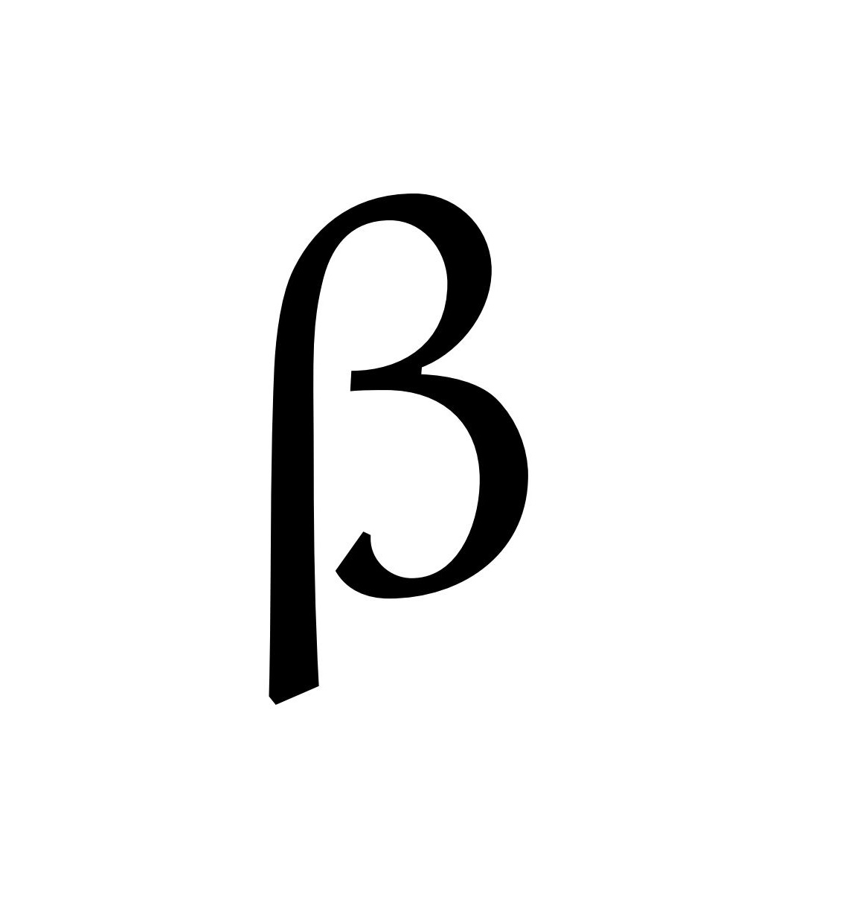
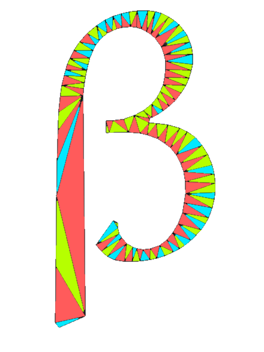
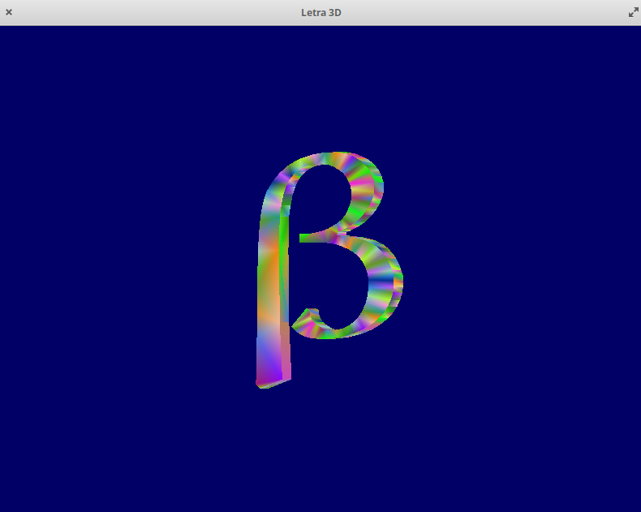
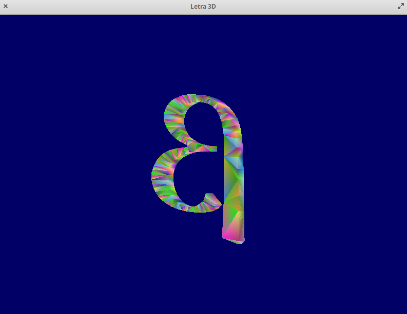
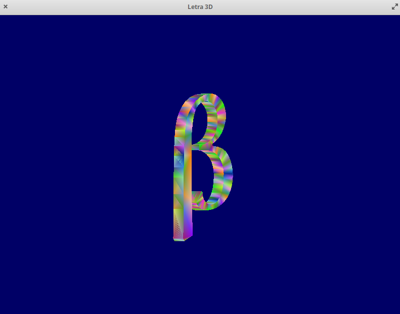
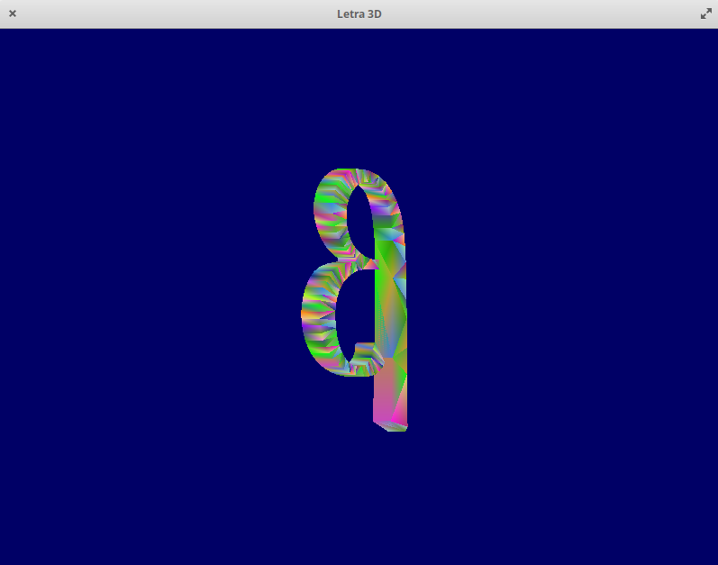
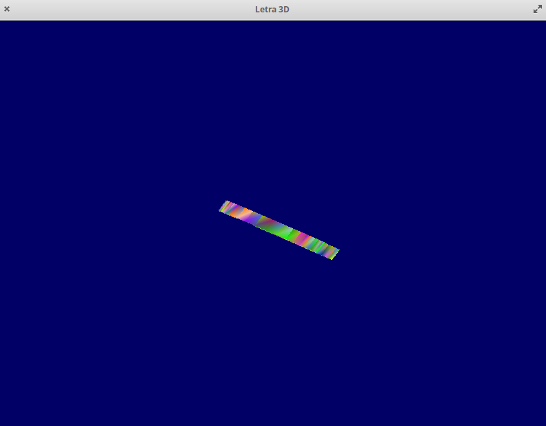
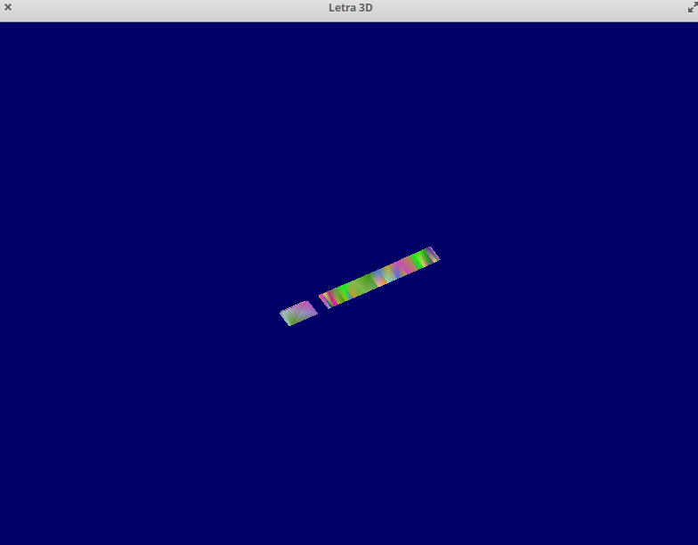

# Computação Gráfica - TP3 Símbolo 3D
> Ana Rocha, a63971

## Objetivo
Mostrar o símbolo colorido modelado a partir de triângulos. </p>

## Plataforma de Desenvolvimento
- [Github](https://github.com/AnaLuciaRocha/CG)
- Sistema Operativo: ***Elementary***, versão 5.1.6 Hera (Distribuição Ubuntu)
- Compilador 
    ```
    gcc-10 | 10.1.0-2ubuntu1~18.04 | amd64 | GNU C compiler
    ```
    </p>
    
- Bibliotecas Necessárias
    1. glad.h
    2. glfw3.h
    3. iostrem
    4. glm.hpp
    5. glm/gtc/matrix_transform.hpp
    6. glm/gtc/type_ptr.hpp


- Método de "triangulização"

1. Foi utilizado o software *Gimp* para dividir a letra em diferentes triângulos, como se pode oservar pelas <a href="figura2">Figura 1</a> e <a href="figura2">Figura 2</a>. </p> 
 
 <figure class="Figura">
        
        <figcaption>Figura 1 - Letra</figcaption>
        </figure>

 <figure class="Figura">
        
        <figcaption>Figura 2 - Letra dividida em diferentes triângulos</figcaption>
        </figure>

2. De seguida, guardaram-se manualmente as coordendas de cada vértice do triângulo desenhado atribuindo um número a cada coordenada. Desta forma temos 2 ficheiros, um com as coordenadas (em pixel) e outra com os indices das coordenadas para cada vértice.

3. Desenvolveu-se um conversor de pixel para coordenadas entre -1 e 1 a serem usadas na representação da letra com base na resolução utilizada.
    - ```Compile > gcc -W pixelToCoordinates.c -o pixelToCoordinates```
    - ```Run > ./pixelToCoordinates <pixel.txt >coord.txt```

4. Foram acrescentados novos triângulos e alteraram-se as coordendas correspondentes ao eixo de Z para formar a letra em 3D. Acrescentaram-se as laterais da letra para unir a face frontal com a traseira. </p>


- Ângulo de visâo ortogonal

Foi pedido um ângulo de 30º em torno do eixo dos Y, o que significa que a letra terá de estar "rodada" ligeiramente para a frente. </p>

## Resultados
- build: </P>
    **BUILD** </p>
    ```
    ana@caju:~/Documents/CG/build$ cmake -S .. -B .
    -- Using X11 for window creation
    CMake Deprecation Warning at external/glm-0.9.7.1/CMakeLists.txt:1 (cmake_minimum_required):
    Compatibility with CMake < 2.8.12 will be removed from a future version of
    CMake.

    Update the VERSION argument <min> value or use a ...<max> suffix to tell
    CMake that the project does not need compatibility with older versions.


    -- GLM is a header only library, no need to build it. Set the option GLM_TEST_ENABLE with ON to build and run the test bench
    -- Configuring done
    -- Generating done
    -- Build files have been written to: /home/ana/Documents/CG/build
    ```
    </P>

    **MAKE** </p>
    ```
    ana@caju:~/Documents/CG/build$ make
    [ 12%] Built target glfw
    [ 15%] Built target wave
    [ 18%] Built target simple
    [ 21%] Built target gears
    [ 23%] Built target boing
    [ 25%] Built target heightmap
    [ 27%] Built target splitview
    [ 29%] Built target offscreen
    [ 33%] Built target particles
    [ 35%] Built target sharing
    [ 37%] Built target title
    [ 39%] Built target timeout
    [ 42%] Built target monitors
    [ 45%] Built target clipboard
    [ 47%] Built target cursor
    [ 50%] Built target msaa
    [ 54%] Built target glfwinfo
    [ 57%] Built target threads
    [ 59%] Built target reopen
    [ 61%] Built target triangle-vulkan
    [ 63%] Built target opacity
    [ 66%] Built target iconify
    [ 68%] Built target gamma
    [ 71%] Built target events
    [ 73%] Built target icon
    [ 75%] Built target joysticks
    [ 78%] Built target windows
    [ 81%] Built target empty
    [ 84%] Built target inputlag
    [ 86%] Built target tearing
    [ 86%] Generating HTML documentation
    [ 86%] Built target docs
    [ 87%] Built target glad
    [ 89%] Built target tp1
    [ 90%] Built target tp1.ex1
    [ 92%] Built target tp2_ex1
    [ 93%] Built target tp2_ex2
    [ 94%] Built target tp2_ex3
    [ 96%] Built target tp2_ex4
    [ 97%] Built target tp3_ex1
    [ 99%] Built target tp3_ex2
    [100%] Built target tp4
    ```
    </P>
- run
    1. Para executar o progama corre-se o seguinte comando: ```ana@caju:~/Documents/CG/build$ ./tp3_ex2/tp3_ex2``` 

    2. Assim que o programa é executado aparece uma janela com o título *Letra 3D* com dimensão 800x600, como se pode ver na <a href="figura3">Figura 3</a> cuja letra tem um angulo de 30º em torno do eixo vertical</p>    
        <figure class="Figura">
        
        <figcaption>Figura 3 - Ecrã inicial e visão ortogonal frontal da letra</figcaption>
        </figure>
    
    3. Quando é pressionada a tecla *A* a posição da camera é agora a vista de trás da letra, como se pode ver na <a href="figura4">Figura 4</a> cuja letra tem um angulo de 30º em torno do eixo vertical</p>
    
        <figure class="Figura">
        
        <figcaption>Figura 4 - Visão ortogonal Posterior da letra </figcaption>
        </figure>
    

    4. Quando é pressionada a tecla *E* temos a vista ortogonal esquerda da letra, como se pode ver na <a href="figura5">Figura 5</a> cuja letra tem um angulo de 30º em torno do eixo vertical</p>
    
        <figure class="Figura">
        
        <figcaption>Figura 5 - Visão ortogonal do lado esquerdo da letra </figcaption>
        </figure>
    
        

    5. Quando é pressionada a tecla *D* temos a vista ortogonal direita da letra, como se pode ver na <a href="figura6">Figura 6</a> cuja letra tem um angulo de 30º em torno do eixo vertical</p>
        <figure class="Figura">
        
        <figcaption>Figura 6 - Visão ortogonal do lado direito da letra </figcaption>
        </figure>
    
    
    6. Quando é pressionada a tecla *C* temos a vista ortogonal correspondente à parte de cima da letra, como se pode ver na <a href="figura6">Figura 6</a> cuja letra tem um angulo de 30º em torno do eixo vertical</p>
        <figure class="Figura">
        
        <figcaption>Figura 6 - Visão ortogonal da parte de cima da letra </figcaption>
        </figure>
    
        
    7. Quando é pressionada a tecla *E* temos a vista ortogonal correspondente à parte de baixo da letra, como se pode ver na <a href="figura7">Figura 7</a> cuja letra tem um angulo de 30º em torno do eixo vertical</p>
    
        <figure class="Figura">
        
        <figcaption>Figura 7 - Visão ortogonal do lado esquerdo da letra </figcaption>
        </figure>
    
        


    
    8. Quando é pressionada a tecla *Enter* a janela fecha-se e é terminada a execução.
    
